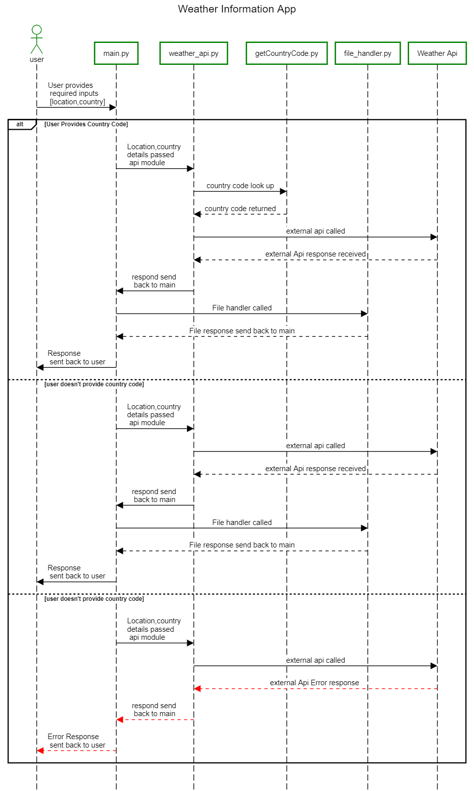

# _Weather Information App_

Welcome to the Weather Information App! This application allows users to fetch current weather information for a specific city using the OpenWeatherMap API. The fetched data is then displayed on the console and saved to a text file for future reference.

## Features

- Fetches current weather data from OpenWeatherMap API.
- Displays weather information including temperature, weather description, humidity, and wind speed.
- Writes weather information to a text file for offline access.

## Prerequisites

- Python 3.x installed on your system.
- OpenWeatherMap API key. You can obtain it by signing up at [OpenWeatherMap](https://home.openweathermap.org/users/sign_up).

## Tech
- Python 3.x 
- Docstring documentation
- Json data
- Pyhton Unit Tests
- Git Hub

## Installation

1. Obtain your OpenWeatherMap API key by signing up at [OpenWeatherMap](https://home.openweathermap.org/users/sign_up).

2. Run the application:

    ```bash
    python weather_app.py
    ```
## Sequence Diagram


## Usage

1. Obtain your OpenWeatherMap API key by signing up at [OpenWeatherMap](https://home.openweathermap.org/users/sign_up).

2. Run the application:

    ```bash
    python weather_app.py
    ```

3. Follow the on-screen prompts to enter your API key and the city name for which you want to fetch weather information.
####  _user journey1_ : user provides country name along with citi location
   **Note:** When entering the city name, ensure to provide the following:
   - Exact City Name: Spell the city name correctly to ensure accurate results (e.g., "New York", "London").
   - Country (Optional): User is asked to provide optional Country name (e.g., "USA","Australia").
   - Special Characters: Input special characters or diacritics correctly if applicable (e.g., "Paris", "München").
   - Alternative Names: Use alternative or local names if known (e.g., "Mumbai" for "Bombay").
   - City Name with Spaces: Input the city name with spaces as it appears (e.g., "Los Angeles", "San Francisco").
   - City District or Area (Optional): Specify a district or area within larger cities for more localized weather data (e.g., "Manhattan, New York", "Shinjuku, Tokyo").
   - 
####  _user journey2_ : when user provides only citi location
   **Note:** When entering the city name, ensure to provide the following:
   - Exact City Name: Spell the city name correctly to ensure accurate results (e.g., "New York", "London").
   - Country (Optional): Can press enter to optout the value.
   - Special Characters: Input special characters or diacritics correctly if applicable (e.g., "Paris", "München").
   - Alternative Names: Use alternative or local names if known (e.g., "Mumbai" for "Bombay").
   - City Name with Spaces: Input the city name with spaces as it appears (e.g., "Los Angeles", "San Francisco").
   - City District or Area (Optional): Specify a district or area within larger cities for more localized weather data (e.g., "Manhattan, New York", "Shinjuku, Tokyo").

## License

This project is licensed under the MIT License - see the [LICENSE](LICENSE) file for details.