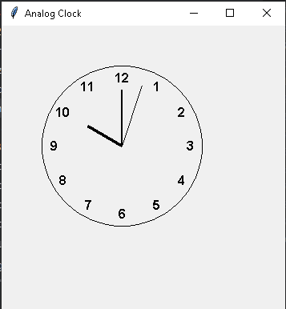

# Analog Clock

A Tkinter program that draws a working analog clock on a canvas — face, hour
numbers, and moving hour/minute/second hands. The clock always starts at
10 o'clock and ticks forward once per second.



## How to run

```bash
python analog_clock.py
```

## Dependencies

- `tkinter` — GUI (ships with the standard Python installer)
- `math` — standard library

## Pyodide-runnable

No. It draws to a Tkinter canvas window, which is not available in the
in-browser Pyodide playground.
