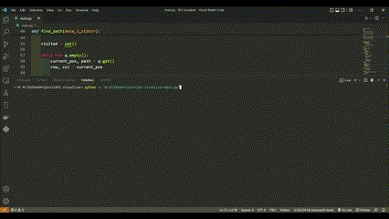

# BFS algorithm visulizer
  This project helps us to visualize BFS algorithm by searching end point from start in a maze.

# Tech Stack:
  Python
 
# Library used: 

  * [curses](docs.python.org/3/howto/curses.html) library to display result in terminal

  * Time library to delay the result for easiser viewing of terminal result at each step 
 
# Output:

