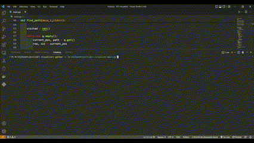

# BFS algorithm visulizer
  This project helps us to visualize BFS algorithm by searching end point from start in a maze.

## Example

1. Run `python main.py`. A curses terminal window opens displaying the 9x8 maze
   with `#` walls, spaces for open paths, `O` as the start position, and `X` as
   the end.
2. The BFS algorithm explores cells level by level. Each visited cell on the
   current path is highlighted in red (`X`) while the walls and open cells are
   shown in green.
3. After a 0.2-second delay per step, the algorithm finds the shortest path from
   `O` to `X` and the final path remains highlighted on screen.
4. Press any key to exit.

# Tech Stack:
  Python
 
# Library used: 

  * [curses](docs.python.org/3/howto/curses.html) library to display result in terminal

  * Time library to delay the result for easiser viewing of terminal result at each step 
 
# Output:

