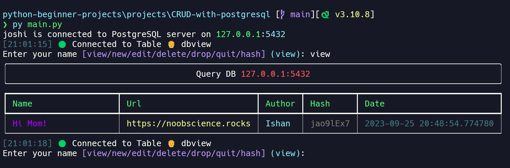

# CRUD CLI with 🐘 PostgreSQL

Well, this is a simple CRUD CLI with PostgreSQL. I made this project to help others learn more about PostgreSQL driver for Python and how to create beautiful and interactive CLI's with Python.

Well it is basically a book mark manager, you can add, edit, delete and list your bookmarks.

It is called the Query DB btw.

## What you can learn

I highly recommend you try and read through the code.
As a beginner, it is far easier to read code that is more like what you would write yourself, and this is a good example of that.
It doesn't use any advanced Python features, and it doesn't use any advanced SQL features either.

So, no classes, confusing context managers, or anything like that.
Just plain old functions and SQL.

So, if you are a beginner, you can learn:

- Asking better input from the user
- Using PostgreSQL with Python
- Creating beautiful and interactive CLI's with Python
- Create, Read, Update and Delete (CRUD) operations with PostgreSQL

If you find this project useful, please give it's parent a star.

## Screenshot



## Features

1. Easy to use
2. Interactive
3. Beautiful
4. No need to remember SQL commands
5. Fast and lightweight

## Prerequisites

- Python 3.6 or higher
- PostgreSQL 9.5 or higher

### Python dependencies

- psycopg2
- rich

These dependencies are already in the `requirements.txt` file.

### Create a database

We use postgresql as our database, so you need to create a database with any name and enter the credentials in the `creds.json` file.

```bash
createdb db_name
```

## How to use

First, you need to install the dependencies:

```bash
pip install -r requirements.txt
```

Then, you need to create a `creds.json` file with the following info:

```json
{
    "username": "postgres",
    "password": "password",
    "host": "127.0.0.1",
    "port": "5432",
    "database": "test"
}
```

After that, you can run the CLI with:

```bash
python main.py
```

It's done! Now you can use the CLI.
