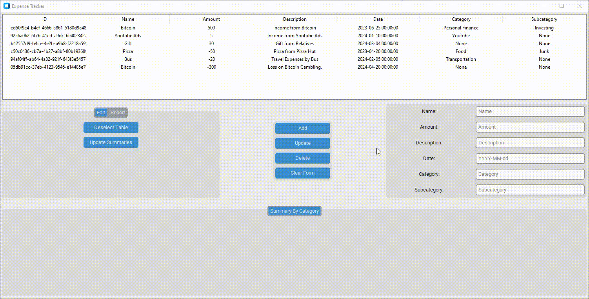
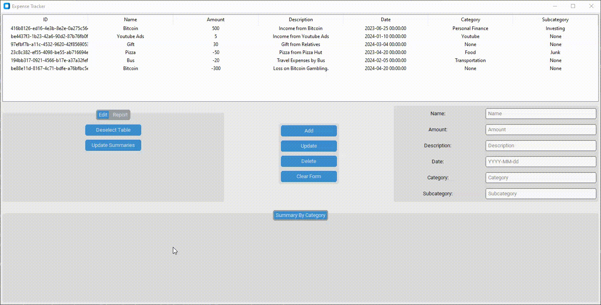
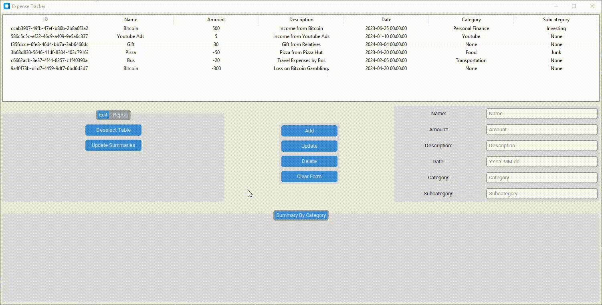
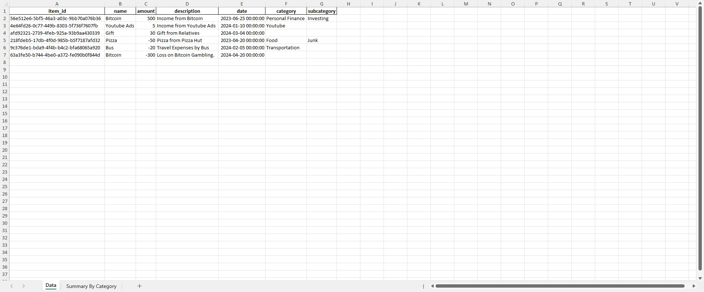
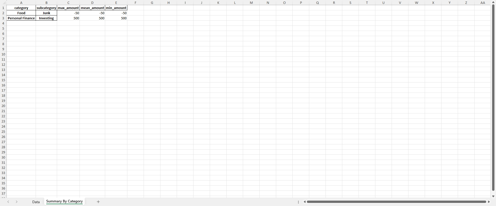
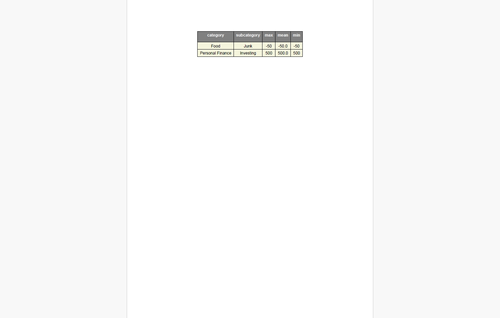

# Expense Tracker Application

The Expense Tracker Application is a GUI application built using Python and
Customtkinter/Tkinter for
managing expenses. It allows users to add, update, and delete expense items, generate reports in Excel and PDF formats,
and visualize expense data by category.

---

## Features

- Add, update, and delete expense items.
- Generate reports in Excel and PDF formats.
- Visualize expense data by category.
- User-friendly graphical interface.

---

## Installation

1. Clone the [python-beginner-projects](https://github.com/Mrinank-Bhowmick/python-beginner-projects) repository to your
   local machine:

   ```
   git clone https://github.com/Mrinank-Bhowmick/python-beginner-projects.git
   ```

2. Navigate to the project directory:

   ```
   cd python-beginner-projects/projects/Expense-Tracker
   ```

3. Install the required dependencies:

   ```
   pip install -r requirements.txt
   ```

---

## Usage

1. Run the application:

   ```
   python app.py
   ```

2. The Expense Tracker GUI will open, allowing you to interact with the application.

3. Add, update, or delete expense items using the provided form and buttons.

4. Generate reports by navigating to the "Report" tab and clicking on the respective buttons for Excel or PDF reports.

5. Visualize expense data by navigating to the "Summary By Category" tab.

You can also run the sample using:

```
python sample.py
```

which would use dummy data to test the app.

---

## Screenshots

### Adding Item



### Updating Item



### Deleting Items


### Viewing Summary Statistics


### Generating Reports



### Excel Report




### PDF Report




---

## Tasks

- [X] Expense Categorization: This feature allows users to classify their expenses into categories like food,
  transportation, and entertainment, and provides a summary based on these categories.
- [X] Date Range Filtering: This feature enables users to filter and view their expenses within a specific date range.
- [X] Expense Analysis: This feature offers statistical insights such as the average expense, highest expense, lowest
  expense, etc.
- [X] Data Saving and Loading: This feature lets users save their expense data to a file (like CSV or JSON) and load it
  back when needed.
- [X] Data Export to PDF/Excel: This feature enables users to export their expense data to common formats like PDF or
  Excel for easy sharing or printing.
- [ ] Currency Converter: For users dealing with multiple currencies, this feature provides an option to convert
  expenses to a preferred currency.


