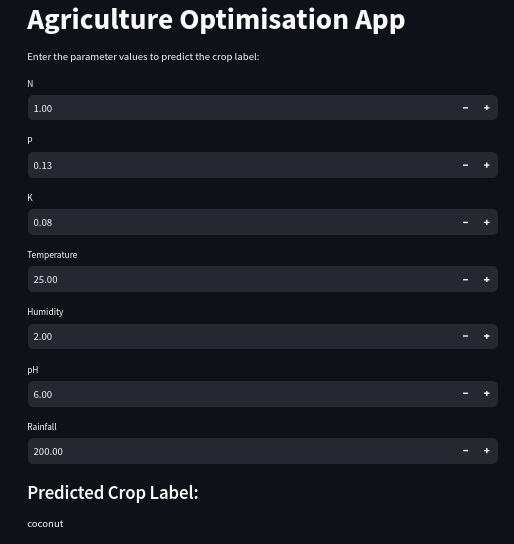
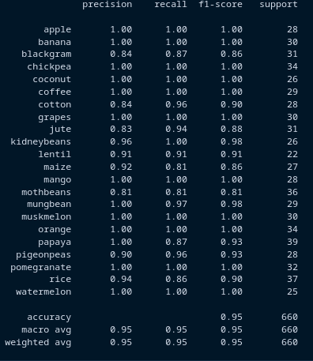
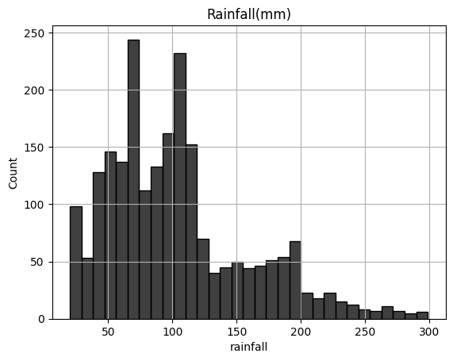
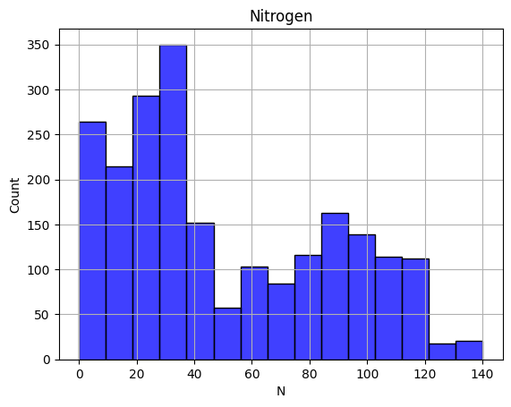
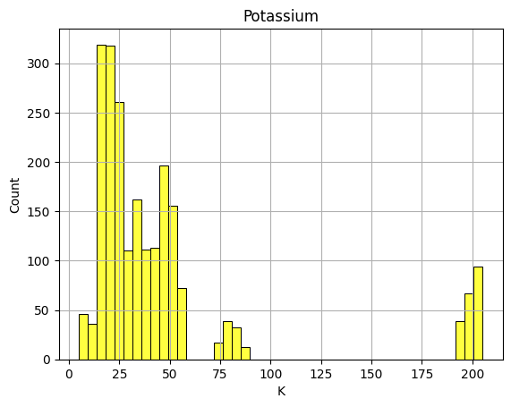

# Description

Agriculture Optimisation ML app performs performs KMeans clustering on the input data to provide clustering labels for the given parameter values and Supervised Learning based Logistic Regression Model to predict suitable crop for the given environmental conditions in the backend.
In the front-end we have a streamlit based application for user interaction.

Frontend:

Model Classification Report(Backend Model: agriculture.ipynb):

To Run:
>cd Agriculture Optimization ML Model
>streamlit run streamlit.py

Requirements:
numpy
pandas
scikit-learn
streamlit
matplotlib
seaborn

>pip install numpy pandas scikit-learn streamlit matplotlib seaborn

Some Imp Graphs:

