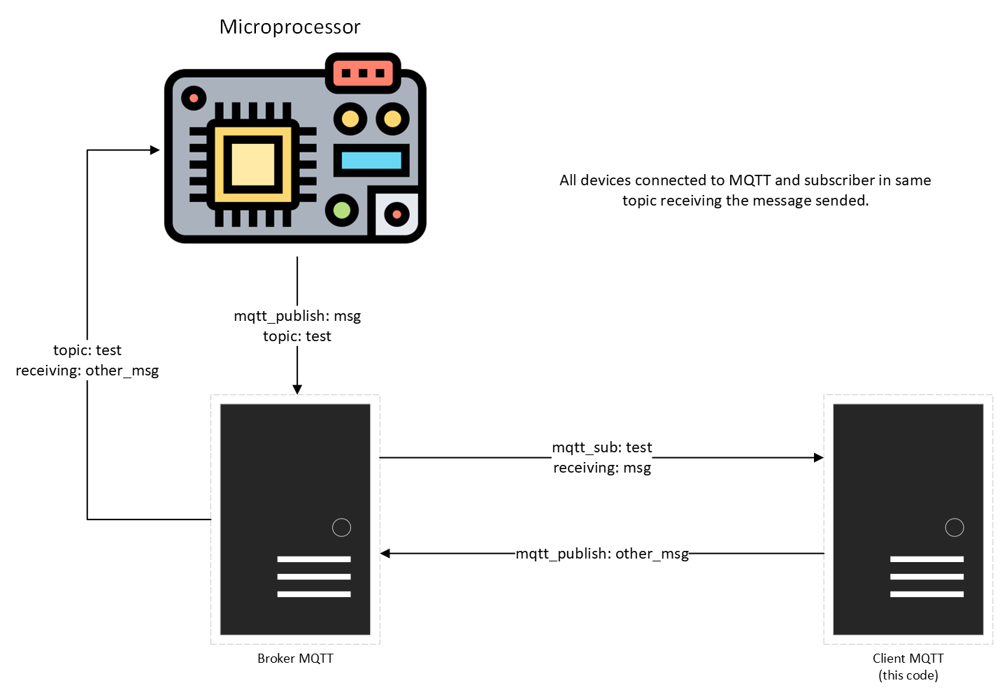
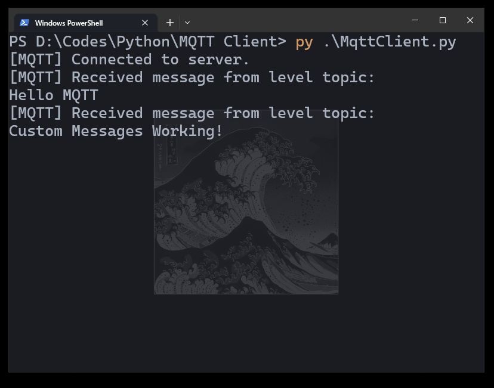

# MQTT Client
> This code connects to an MQTT broker to publish and subscribe to topics to receive messages.

## MQTT Operation


## Requirements
```sh
pip install -r requirements.txt
```

This file includes:
```
paho-mqtt==1.6.1
python-decouple==3.8
```

## How to execute?
1. You need a Broker MQTT running. I recommend [Mosquitto](https://mosquitto.org/download/). 
Ex (Do not need to do):
    - `mosquitto -v`: Running Broker;
    - `mosquitto  mosquitto_sub -h BROKER_IP -p PORT -t TOPIC`: Subscribe in topic.
    - ` mosquitto_pub -h BROKER_IP -p PORT -t TOPIC -m MESSAGE`: Publish "MESSAGE" in topic.
2. Duplicate the `.env-example` file and configure it;
3. Edit name `.env-example` to `.env`;
4. Execute `MqttClient.py`.

```sh
python3 MqttClient.py
```

## Code Running
